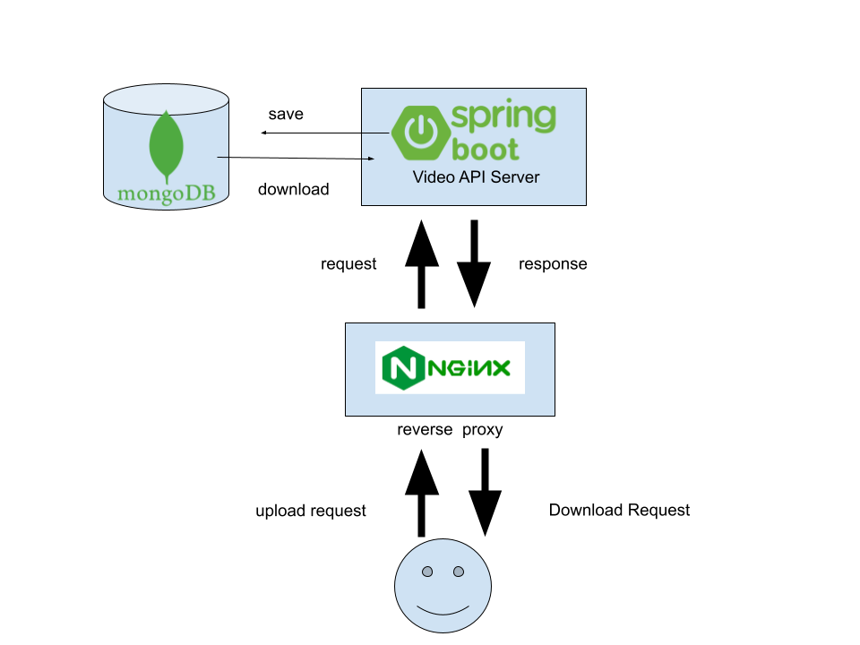

# Woven planet coding challenge: Video storage REST Api server  

---------------------
## Overview 
This repository is a Kenta Utsunomiya's solution of woven planet coding challenge.
I added following files from the initial commit. 
* java implementation of movie storage server (src/main) 
* java unit tests of movie storage server (src/test/*)
* build script for building java (build.gradle, gradlew, gradlew.bat, gradle/*)
* nginx.config file for reverse proxy (will describe why reverse proxy is needed)
* Docker related files to run the pipeline on github actions (docker-compose.yml and Dockerfile)

## How to run the application
Use docker-compose to run the application 
##### command 

```shell
git clone git@github.com:cityos-dev/Kenta-Utsunomiya.git
cd Kenta-Utsunomiya
docker-compose up -d --wait
```

## implementation details on the API
I've used spring boot application framework to implement the API. Why I used the api was Spring boot is 
* stable and maintainable, so it is used from a lot of enterprise application. 
* Java is used from many companies, a lot of test frameworks can be used.

### controllers
In order to handle the request, I've separated 5 controllers.
#### Healthcheck controller
Just checking health is ok or not. it returns "OK" as string with 200 response. It is mainly used from ~~pod~~ container health checking on ~~kubernates~~ docker compose.   
#### File upload controller
Controller for POST request to `/v1/files`, it only accept from the request with multipart that has "data" as a name.
Once it receives the request, it will save them the file storage, generate object id, and return the object id  as Location header in response.
#### File download controller 
Accept GET request to `/v1/files/id`, then check the file with the id exists, and provide the content as a body of the reqest if exists.
If the id doesn't exist on the storage, it returns 404 not found.
Also Get request to `/v1/files` will return the list of saved files as json format.
#### File delete controller  
Accept DELETE request to `/v1/files/id`. If exists, delete the id from the storage, otherwise returns 404. 

#### Error handle controller advice 
This will mainly handle the Bad request to the query on upload controller. If file upload controller encounters an error when getting request. This controller advice will catch the failure and provide 410 Bad request to users.

### storages 
In order to save the files on storage, I prepare one file storage handler interface in Java, and provide two implementation
for the abstract storage interface.
#### File in memory storage 
Save all the file on memory, that means all the id-file mapping is saved as HashMap in java.
It's almost equivalent with using memcached or redis. It's not scalable and persistent, but the response is quite fast.
#### File in mongo storage
Save the data on mongodb. All the mongo interfaces are written in [spring mongo repository](https://www.mongodb.com/compatibility/spring-boot).
Considering that the files need to be stored for a long period of time, you should take this option.

The "schema" of movie metadata file is as follows.
```json
{
  "id": "Unique id that represents movie, that should be indexed.",
  "name": "original filename of the movie",
  "content_type": "wheather this is video/mp4 or video/mpeg",
  "created_at":"ISO format of the movie created",
  "content": "Binary of the movie",
  "size": "byte size of the movie"
}
```

### Other java library to implement the API and test.
* [Apache Log4j](https://logging.apache.org/log4j/2.x/): logging library for debugging 
* [jackson](https://github.com/FasterXML/jackson): a library to treat Java's object to json.
* [mockito](https://site.mockito.org/) : mock library for using unit test 


## Infrastructure Architecture. 


In docker application environment, we will launch three ~~pods~~ containers as follows
* mongodb service: storage for saving video data on mogodb. it requires authentication. 
* UploadService: Java application for that project, it depends on mongo service. It checks health endpoint every five seconds to check the availabiltiy.
* nginx: reverse proxy for forwording HTTP requests to api server. It will launch after Java application is healthly. 


### Referred Websites  
* [spring boot ](https://spring.io/)
* [docker compose](https://docs.docker.com/compose/)
* [gradle](https://gradle.org/)


### comments
* According to the open api document, it requires to implement duplication checking logic for upload controller. I thought it was a good idea to check for duplicates by having different users upload the same file, but there was a possibility of unexpected deletion from the user's perspective when deleting the file, and it was unclear under what conditions conflicts would occur, so upload conflicts were not implemented (It would have been nice if it had been included in the test case.
* The most painful point for me in the implementation is  how to pass the last testcase (upload something with no content). This sort of error cannot be handled from Exception controller, and I did not know the controller advice before, so it took much time to make it pass the testcase.
* In the github action, it seems newman will be run after `docker-compose -d` is executed immediately, but my webapplication will take 10-20 seconds to launch everything, and they don't use --wait option for testing, so initially the test was always failed because test doesn't  wait until application launch. The biggest reason of using nginx as reverse proxy was I want to run another container that can wait until the application healthcheck is ok. As you can see the commit history of docker-compose, I ran dummy container for the usage initially.   
